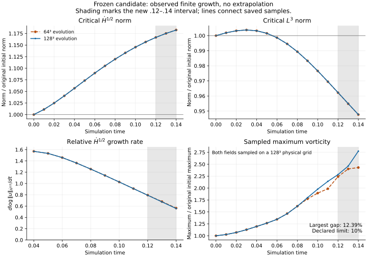

# Frozen late-growth continuation from .12 to .14

This bounded experiment continues the unchanged bandwidth-three initial field
from each grid's own published `.12` evolved state. It retains the original
initial normalization and complete observation and critical-budget histories.
The coefficients are not optimized on these additional times.

**Status: both legs completed; all declared checks pass at `.13`, but the
vorticity agreement gate fails at `.14`.** The `64/128` pair is not promoted
beyond this horizon. The local maximum differs by `12.38592%` on common `128`
physical samples and `12.65415%` on `256` samples, exceeding the unchanged `10%`
limit. Denser sampling does not remove the discrepancy.

Fine-grid H1/2 grows `18.238995%`, while L3 falls `5.228507%`. The critical
logarithmic rate remains positive but falls from `.791847344` at `.12` to
`.556530448` at `.14`. Thus the measured finite norm growth continues to slow;
there is no demonstrated blow-up. The final fine-grid sampled vorticity is
`2.782755111` times its initial value on `256` samples, but the failed spatial
comparison prevents treating that value as a converged PDE maximum.

## Completed measurements

All ratios retain the original initial normalization. The main table uses
common physical samples on grid `128`. Cutoff entries are energy fractions,
not percentages, and accepted-step counts include the preceding history.

| Quantity | T=.13, N=64 | T=.13, N=128 | T=.14, N=64 | T=.14, N=128 |
|---|---:|---:|---:|---:|
| H1/2 / initial | 1.175188141 | 1.175133020 | 1.182529551 | 1.182389951 |
| L3 / initial | 0.954872004 | 0.954974693 | 0.947658929 | 0.947714927 |
| Sampled vorticity / initial | 2.401705455 | 2.461235964 | 2.431032592 | 2.774705373 |
| Enstrophy / initial | 2.480876917 | 2.485959733 | 2.638033817 | 2.644434140 |
| Characteristic wavenumber / initial | 1.611400195 | 1.613064784 | 1.666377215 | 1.668423352 |
| Critical logarithmic growth rate | 0.680172614 | 0.674471206 | 0.564763064 | 0.556530448 |
| Critical production / viscous destruction | 2.149696815 | 2.114585415 | 1.831454648 | 1.796416823 |
| Enstrophy stretching / viscous destruction | 3.20943883 | 3.00714273 | 2.71418137 | 2.53352422 |
| Peak per-step cutoff energy fraction | 0.000191411235 | 1.38374379e-06 | 0.00032513222 | 2.84056791e-06 |
| Accepted steps | 1289 | 2412 | 1449 | 2749 |

The coarse leg takes 308 new accepted steps and `46.24` seconds of solver
time; the fine leg takes 645 new steps and `1597.85` seconds (about 26.6
minutes). Fine H1/2 gains another `1.357914%` over `.12--.14`, above the
retained `0.1%` late-window criterion. Critical production remains greater
than viscous destruction, but their ratio falls from `2.518860450` to
`1.796416823`. Growth continues while its relative rate slows.



The curves join recorded observations only. Near-identical global norms
do not imply equally accurate local peaks. The small cutoff fractions also
do not override the failed vorticity comparison.

## Resolution gaps and the fixed limits

These are maximum trajectory-relative gaps through each horizon.
Stretching uses the final `.02` window. The worst vorticity gap through
`.13` occurs at `.11`; the larger gap through `.14` occurs at `.14`.

| Check | Through .13 | Through .14 | Limit |
|---|---:|---:|---:|
| H1/2 ratio gap | 0.00469037% | 0.01180523% | 2% |
| L3 ratio gap | 0.01214272% | 0.01214272% | 2% |
| Enstrophy ratio gap | 0.20446094% | 0.24202997% | 5% |
| Characteristic wavenumber ratio gap | 0.10319416% | 0.12263895% | 5% |
| Sampled vorticity ratio gap | 7.18808160% | 12.38591973% | 10% |
| Late stretching gap | 3.84431904% | 5.18782776% | 10% |
| Horizon times maximum critical-rate gap | 0.000741182963 | 0.00115256632 | .002 |

All other declared trajectory gates pass. The largest native-to-common
vorticity sampling shift remains `1.345230%`, below `2%`. These limits
control empirical screening, not distance to a proof.

## Endpoint physical sampling

Initial sampled maxima are `82.55311350` and `82.60944619` on grids
`128` and `256`, shared by both evolutions. Normalized maxima need not
increase with sampling density because their initial denominator also changes.

| Evolved field | Vorticity ratio, 128 samples | Ratio, 256 samples | Raw maximum shift | Ratio shift |
|---|---:|---:|---:|---:|
| N=64, T=0.13 | 2.401705455 | 2.405560934 | 0.228356% | 0.160274% |
| N=128, T=0.13 | 2.461235964 | 2.467900644 | 0.338062% | 0.270055% |
| N=64, T=0.14 | 2.431032592 | 2.430621058 | 0.051272% | 0.016928% |
| N=128, T=0.14 | 2.774705373 | 2.782755111 | 0.357267% | 0.289272% |

All raw and normalized within-field sampling shifts pass the `2%` limit.
The cross-evolution gap on `256` samples is `2.526022%` at `.13` and
`12.654152%` at `.14`. The final fine sampled maximum is `229.881858561`.
The `.14` mismatch therefore persists when both fields are sampled more
densely; it is not resolved by this sampling refinement.

## Research decision

The last passing declared horizon is `.13`. Pause further time extension
with the `64/128` pair. The next spatial comparison should test the same
frozen initial field through `.14` on a finer evolution grid against `128`
(for example, `128/256`), with appropriate timestep and independent-solver
checks. A new fine evolution must start from the original coefficients or
its own validated earlier state, not an upsampled evolved coarse field.

This numerical failure does not establish that the initial field cannot
produce a singularity. It establishes that the current grid pair fails our
declared local-vorticity agreement requirement. Low cutoff energy and
accurate global norm agreement are insufficient to promote the result.

## Frozen protocol

[`protocol.json`](protocol.json) was fixed before either leg started. Its
SHA-256 is `4484ad472b9f7cd9936acb2a38b309c7fd3a54f882af2eb4278de9de8ac26491`.
The driver SHA-256 is
`e91c840d59d84eabe469d8954ae8d54cc92e5797b0e1429ac962235c82aa46fa`.
The preceding published commit is
`c7ffa0cfbd68ed07f212fc31a9008d0ee0e8827d`.

Both evolution grids (`64`, `128`) restore their own checksummed multipart
`.12` state from `late_growth_t012`. Fourier cutoffs remain `21`, `42`;
initial energy `10`, viscosity `.02`, maximum timestep `.000125`, CFL `.4`,
observation interval `.01`, common physical sampling grid `128`, and
per-step cutoff-energy fraction limit `.008` are unchanged. The target times
are `.13` and `.14`. The CLI cannot override the restored scientific settings.

The initial coefficient SHA-256 remains
`893ef61450d670936dc851d28ab3cf7c1aa315c6ff23934646e74137c40ac6ef`.
The executable SHA-256 remains
`3bc968559635109d627fdd2d7e45e47b8aa3b387e563824f58c0b4020d0c5c9a`;
the executable and all previously recorded solver sources are checked before
evolution. No evolved coarse field is padded into the fine grid.

The archived `.12` history reader is executed in a separate Python process
to prevent the two experiments' same-named modules from mixing. Its source
and assessment hashes are pinned by the protocol. The new driver preserves
the parent's `.12` checkpoint metadata while inheriting every earlier critical
budget. This distinction prevents a stale restart or a reset of the late-time
comparison window. The source assessment must have passed its declared gates.

## Assessment and interpretation

The unchanged `late_growth_continuation/assess.py:paired` implementation
compares the complete histories at both declared horizons. Relative gaps
mean `abs(a-b)/max(abs(a),abs(b))`. Limits remain `2%` for H1/2 and L3 ratios,
`5%` for enstrophy and characteristic wavenumber ratios, and `10%` for sampled
vorticity ratios and late stretching. The late window remains `.02`.
H1/2 must gain at least `0.1%` in that window without a sampled reversal;
sampled late enstrophy stretching must exceed its viscous destruction.

Critical logarithmic rates must stay positive at the retained samples over
the last half of each horizon, and the horizon times their largest
cross-grid absolute difference must not exceed `.002`. Native-to-common
vorticity sampling must shift by at most `2%`. The inherited Fourier-invariant
and per-step cutoff gates also remain unchanged.

Independent NumPy FFTs check the restored `.12` snapshots and new `.13/.14`
budgets. Both saved endpoint fields are sampled on physical grids `128` and
`256`, with their initial maxima evaluated on those same grids. Raw maxima
and initial-normalized ratios may each shift by at most `2%`. Cross-evolution
vorticity amplification on `256` samples may differ by at most `10%`.
Sampling on `256` points per direction does not constitute a `256`-grid
evolution or a certified bound on the continuous maximum.

The critical budget is for H1/2 squared. Its production/destruction ratio
is different from the enstrophy stretching/destruction ratio. A positive
logarithmic rate means continued growth; a falling positive rate means that
the relative growth is slowing, even when the norm itself is still rising.

These are finite-amplification screening checks. Passing does not establish
an infinite-dimensional PDE tail estimate or blow-up. A numerical gate
failure pauses promotion of this grid pair; it does not by itself reject the
initial field as a possible mechanism. There is no numerical percentage of
completion toward a mathematical proof.

Full independent-solver and smaller-timestep trajectory validation previously
reached `.10` on grid `64`. This extension does not claim those full-trajectory
checks beyond `.10` or an independent full grid-128 evolution. Its additional
independent checks concern saved-state budgets and physical sampling.

## Reproduction

From the repository root, use fresh output directories:

```sh
python3 research/navier_stokes_cascade/results/late_growth_t014/extend.py \
  --solver ./build/research/navier_stokes_cascade/navier_stokes_continue \
  --grid 64 --output-dir new-t014-run/reference64

python3 research/navier_stokes_cascade/results/late_growth_t014/extend.py \
  --solver ./build/research/navier_stokes_cascade/navier_stokes_continue \
  --grid 128 --output-dir new-t014-run/reference128
```

The driver intentionally requires the preceding verified executable hash.
A separately rebuilt binary needs its own preceding validation and declared
provenance; it cannot silently replace the executable in this frozen protocol.
The output directories must not already exist. Exact commands, restart links,
source identities, settings, budgets and endpoint hashes are recorded in the
manifests. Runs stop on the existing cutoff or invariant failure and retain
their last checkpoint and failure evidence.

`analyze.py` evaluates this archive's `reference64` and `reference128`
directories. `archive.py` packages completed states; it may run while another
leg remains active. `audit.py` reports archive integrity separately from the
scientific result. Published archive parts and their indices are sufficient
to restore the states; whole gzip copies are ignored local working files.

All 21 helper regression checks pass; see [`verification.log`](verification.log).
The six new inherited-history checks cover full earlier budgets, immediate
parent checkpoint selection, wrong grids, truncated histories, mixed initial
fields, duplicated budgets and changed parent budget data.

Independent NumPy snapshot diagnostics have maximum relative discrepancy
`5.10993619e-13`, below the retained `1e-10` gate. The full
[`assessment.json`](assessment.json) preserves the failures, while
[`audit.json`](audit.json) verifies archive identity separately.

All four saved states restore exactly to their recorded raw hashes. The two
coarse states each restore `12,583,408` bytes; the two fine states each restore
`100,663,792` bytes. The 24 published parts and their indices retain the full
evolved fields. The GitHub workflow runs the helper tests and reconstructs
the archive audit from a clean checkout; an archive-integrity pass does not
turn the scientific failure into a pass.

Restore an endpoint to a fresh output file:

```sh
python3 research/navier_stokes_cascade/results/frozen_continuations_resolution/restore_checkpoint.py \
  --index research/navier_stokes_cascade/results/late_growth_t014/reference128/t140_checkpoint.json \
  --output fine128-t140-restored.chk
```

Use `reference64` for the coarse field or `t130_checkpoint.json` for `.13`.
The figure is reproduced with `python3 research/navier_stokes_cascade/results/late_growth_t014/plot.py`
using Matplotlib and the verified histories. No trajectory beyond `.14` is part
of this experiment.
